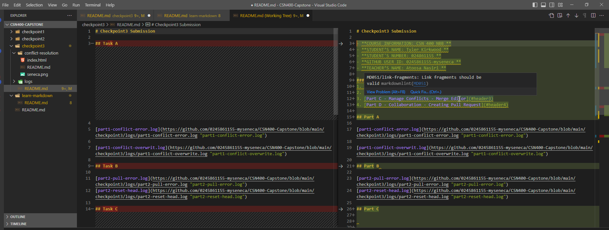
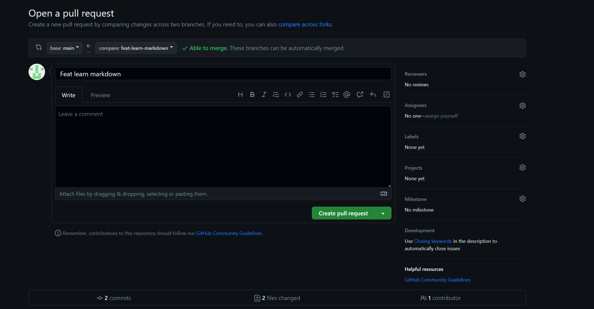

# Checkpoint3 Submission

- **COURSE INFORMATION: CSN400-2234**
- **STUDENT’S NAME: Tyler Kirkwood**
- **STUDENT'S NUMBER: 024861155**
- **GITHUB USER_ID: 024861155-myseneca.ca**
- **TEACHER’S NAME: Atoosa Nasiri**

### Table of Contents
1. [Part A - Manage Conflicts - Overwrite Remote Changes](#header1)
2. [Part B - Manage Conflicts - Reset Local Commit Head](#header2)
3. [Part C - Manage Conflicts - Merge Editor](#header3)
4. [Part D - Collaboration - Creating Pull Request](#header4)

[part1-conflict-error.log](https://github.com/0245861155-myseneca/CSN400-Capstone/blob/main/checkpoint3/logs/part1-conflict-error.log "part1-conflict-error.log")

[part1-conflict-overwrit.log](https://github.com/0245861155-myseneca/CSN400-Capstone/blob/main/checkpoint3/logs/part1-conflict-overwrite.log "part1-conflict-overwrite.log")

## Task B 

[part2-pull-error.log](https://github.com/0245861155-myseneca/CSN400-Capstone/blob/main/checkpoint3/logs/part2-pull-error.log "part2-pull-error.log")
[part2-reset-head.log](https://github.com/0245861155-myseneca/CSN400-Capstone/blob/main/checkpoint3/logs/part2-reset-head.log "part2-reset-head.log")

## Task C

[part3-pull-conflict.log](https://github.com/0245861155-myseneca/CSN400-Capstone/blob/main/checkpoint3/logs/part3-pull-conflict.log "part3-pull-conflict.log")

[part3-git-status.log](https://github.com/0245861155-myseneca/CSN400-Capstone/blob/main/checkpoint3/logs/part3-status.log "part3-git-status.log")

## Task D

