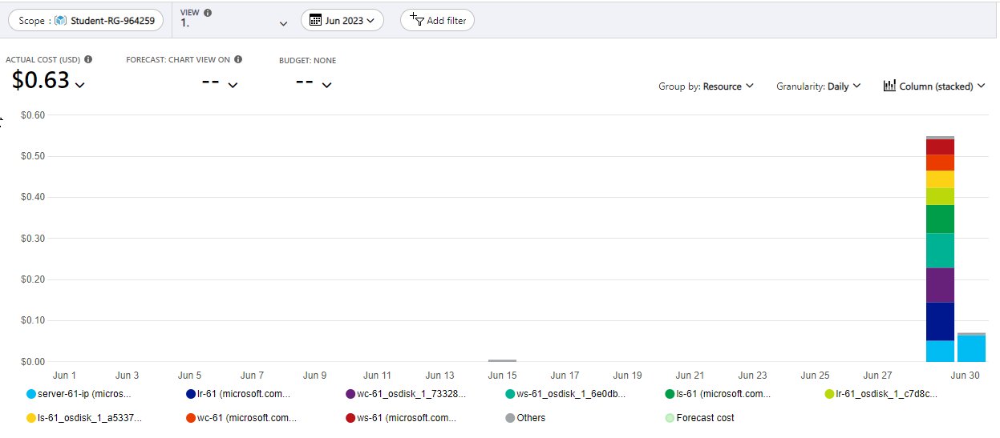
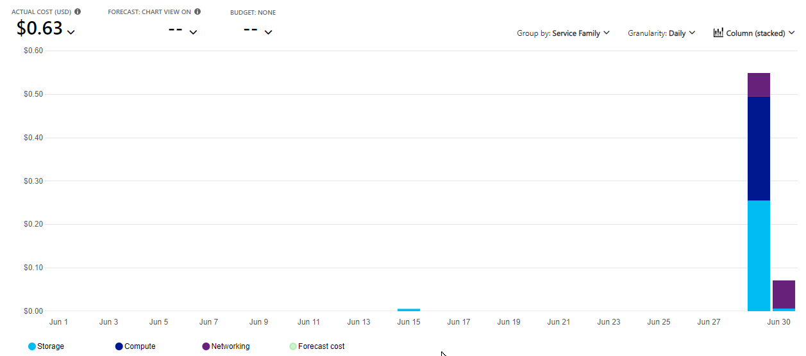
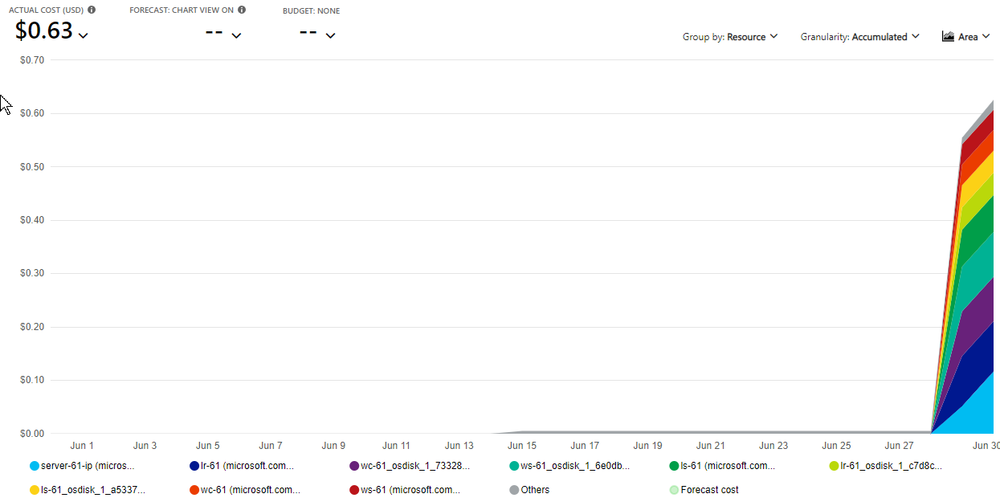
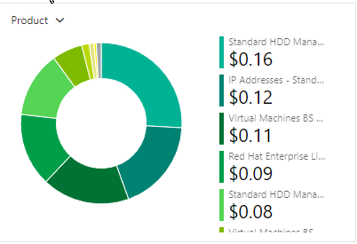
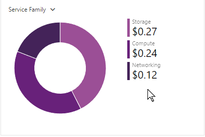
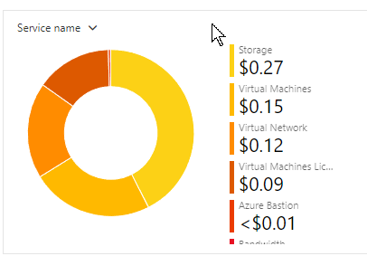
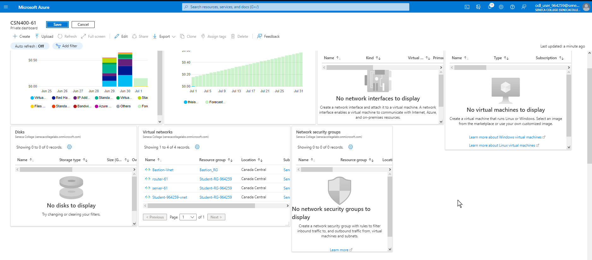

- **COURSE INFORMATION: CSN 400 NBB**
- **STUDENT’S NAME: Tyler Kirkwood**
- **STUDENT'S NUMBER: 024861155**
- **GITHUB USER ID: 0245861155-myseneca**
- **TEACHER’S NAME: Atoosa Nasiri**
<br>

1. [Part A - Creating & Configuring VMs - Using Portal](#part-a)
2. [Part B - Basic Connectivity - VM Configuration](#part-b)
3. [Part C - Enable IP_Forwarding - Using Portal](#part-c)
4. [Part D - Creating & Configuring VM Images - Using Portal](#part-d)
5. [Part E - Azure Cost Analysis Charts](#part-e)
6. [Part F - Create Customized Azure Dashboard](#part-f)

## Part A

### Answer
#### The difference between Windows machine NSG and Linux machine NSG rules lies in the protocols and ports used by each operating system. Windows typically uses RDP (port 3389), while Linux uses SSH (port 22). Deleting specific SSH or RDP rules would block remote access using those protocols.


```
odl_user [ ~ ]$ az vm list --output table
Name    ResourceGroup      Location       Zones
------  -----------------  -------------  -------
LR-61   STUDENT-RG-964259  canadacentral  1
LS-61   STUDENT-RG-964259  canadacentral  1
WC-61   STUDENT-RG-964259  canadacentral  1
WS-61   STUDENT-RG-964259  canadacentral  1

```

## Part B

```json
odl_user [ ~ ]$ az network nic show -g Student-RG-964259 -n lr-61525_z1 --query "enableipforwarding" 
odl_user [ ~ ]$ 
```

## Part C

1.  To remove the firewalld service on a Linux VM, you can use the command: sudo systemctl stop firewalld && sudo systemctl disable firewalld.
2.  command: sudo iptables -L
3. sudo systemctl enable iptables

#### i keep getting the error below ive used chmod 400 as per azure intruction and this would be the third vitual machine that ive tried.
```
tkirkwood@TylerK-1:/mnt/g/semester_5/CSN 400 NBB/Atoosa$ ssh -i routerkey.pem Tkirkwood@20.151.178.14 -p 22
@@@@@@@@@@@@@@@@@@@@@@@@@@@@@@@@@@@@@@@@@@@@@@@@@@@@@@@@@@@
@         WARNING: UNPROTECTED PRIVATE KEY FILE!          @
@@@@@@@@@@@@@@@@@@@@@@@@@@@@@@@@@@@@@@@@@@@@@@@@@@@@@@@@@@@
Permissions 0555 for 'routerkey.pem' are too open.
It is required that your private key files are NOT accessible by others.
This private key will be ignored.
Load key "routerkey.pem": bad permissions
Tkirkwood@20.151.178.14: Permission denied (publickey,gssapi-keyex,gssapi-with-mic).
tkirkwood@TylerK-1:/mnt/g/semester_5/CSN 400 NBB/Atoosa$ chmod 400 routerkey

```


## part D

```table
0.0.1 (LR61/lr-61/0.0.1) VM image version Canada Central
0.0.1 (LS61/LS-61/0.0.1) VM image version Canada Central
0.0.1 (WC61/WC-61/0.0.1) VM image version Canada Central
0.0.1 (WS61/WS-61/0.0.1) VM image version Canada Central
```
<br>

```
odl_user [ ~ ]$ az vm list --output table

odl_user [ ~ ]$ 

```
## Part E
| No. | Scope | Chart Type | VIEW Type |  Date Range | Group By | Granularity| Example |
|-|-|-|-|-|-|-|-|
|1|Student-RG-xxxxxx| Column (Stacked) | DailyCosts | Last 7 Days | Resource | Daily |  |
|2|Student-RG-xxxxxx| Column (Stacked) | DailyCosts | Last 7 Days | Service | Daily |  |
|3|Student-RG-xxxxxx| Area| AccumulatedCosts | Last 7 Days | Resource | Accumulated |  |
|4|Student-RG-xxxxxx| Pie Chart | NA | Last Month | Service Name | NA |  |
|5|Student-RG-xxxxxx| Pie Chart | NA | Last Month | Service Family | NA |  |
|6|Student-RG-xxxxxx| Pie Chart | NA | Last Month | Product | NA |  |


## Part F

 